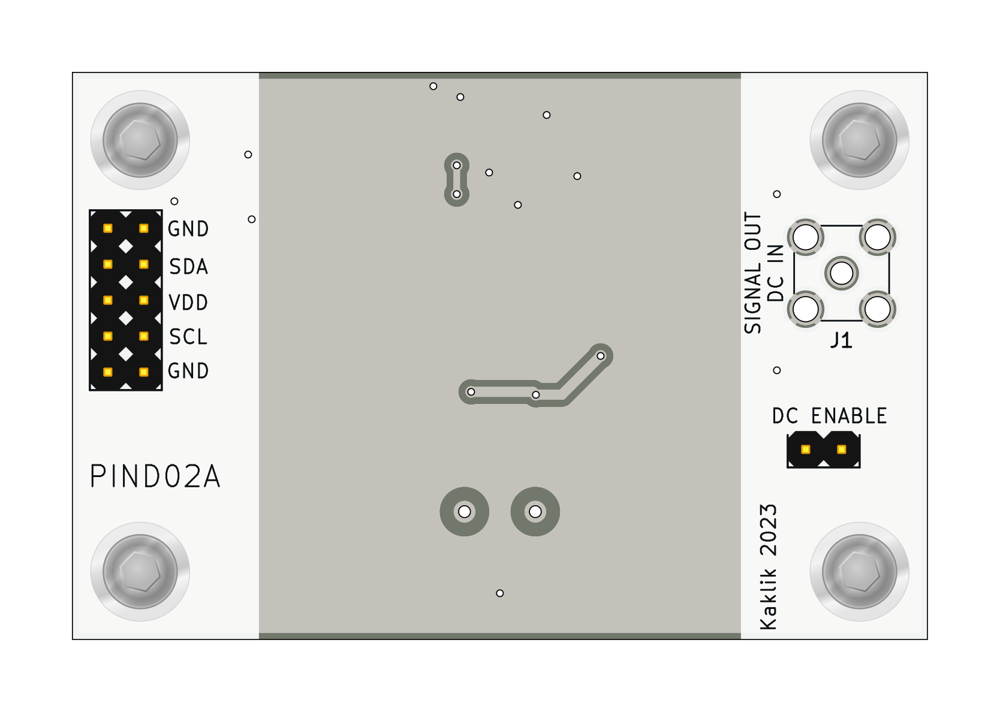
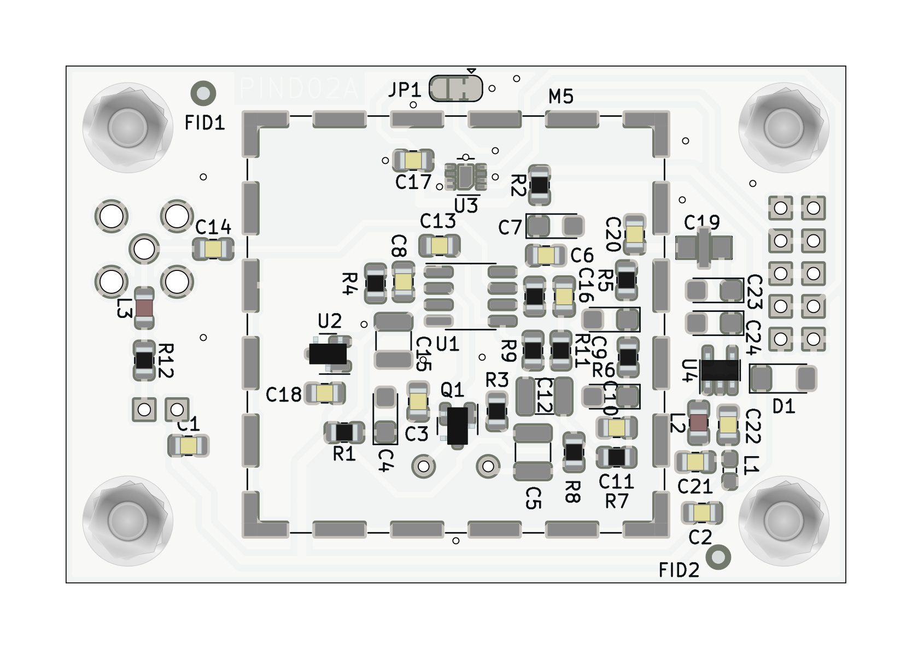

# PIND02 - Solid-state semiconductor radiation detector

The PIN diode semiconductor detector for ionizing radiation. 

## Main features
  - sensitivity to a wide range of ionizing radiation types (charged particles, ions, photons, etc.)
  - Low-power consumtion
  - lightweight

## Basic usage

The module outputs pulses, which need to be digitized for computer processing. The suitable hardware for that task is [PCRD07](https://github.com/mlab-modules/PCRD07)
